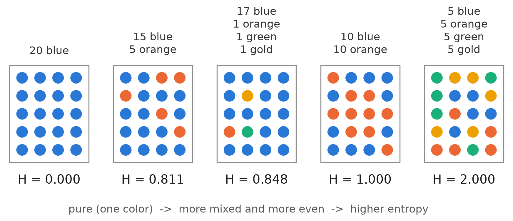

## Learning Objectives

By the end of this lesson you will be able to:

- **Compute** how mixed a node is (entropy or Gini) and how much a split
  gains, **explain** how a tree grows by greedy recursion, and read a fitted
  tree. *(Apply / Understand)*
- **Diagnose** why an unpruned tree overfits, and **use** `max_depth` as the
  flexibility dial. *(Analyze / Apply)*
- **Explain** bagging as variance reduction by averaging many bootstrap-trained
  trees. *(Understand)*
- **Apply** a random forest, read its feature importances, and compare it to a
  single tree. *(Apply / Analyze — in the lab)*

> **Where this sits:** after `L11 — Evaluation Metrics` (which closed Unit III),
> this lesson **opens Unit IV — Ensembles** by turning Unit III's theory into a
> practical win: the high-variance decision tree, cured by averaging. · next:
> `L13 — Boosting` (the bias-cutting half of the unit).
>
> **Hands-on:** [Lab — A Forest of Coqui Trees](l12_lab_trees_bagging.md) ·
> [](https://colab.research.google.com/github///blob//u04_ensembles/l12_lab_trees_bagging.ipynb)

## Why This Matters

Every model so far has been, in some sense, a single equation — a line, a sigmoid, a
margin, a Gaussian. A **decision tree** is different: it is a flowchart of yes/no
questions, the one model in this course a field biologist could read aloud and follow
by hand. That readability is its charm.

It is also its trap. Let a tree grow until every leaf is pure and it will memorize the
training set *perfectly* — train accuracy 1.000 — and then stumble on new data (test
0.717 in the lab). This is the **high-variance** learner L09 described, made concrete:
exquisitely sensitive to the exact sample it saw. The cure that opens this unit is
almost too simple to believe: grow *many* trees on shuffled copies of the data and let
them **vote**. That single idea — the **ensemble** — lifts test accuracy by ten points
and underlies the random forest, still the default first model for tabular data.

::: {.callout-tip title="Analogy"}
Ask one brilliant but opinionated expert to diagnose a frog and you get a confident
answer that swings wildly with the exact cases they happened to study. Ask a **diverse
panel** — each trained on a slightly different sample — and take the majority vote, and
the idiosyncratic errors cancel while the real signal survives. A single deep tree is
the lone expert; a random forest is the panel.
:::

## What a Decision Tree Is

A tree breaks a prediction into a sequence of single-feature questions, starting at the
**root** and walking down to a **leaf** that carries the answer. A toy training set —
tonight, do I party, study, go to the pub, or watch TV? — makes the shape obvious:

| Deadline? | Party? | Lazy? | Activity |
|-----------|--------|-------|----------|
| Urgent | Yes | Yes | Party |
| Urgent | No | Yes | Study |
| Near | Yes | Yes | Party |
| None | Yes | No | Party |
| None | No | Yes | Pub |
| None | Yes | No | Party |
| Near | No | No | Study |
| Near | No | Yes | TV |
| Near | Yes | Yes | Party |
| Urgent | No | No | Study |

The learner picks one question to ask first, splits the rows by the answer, and recurses
on each branch until the rows in a node share a label. The result is a set of if-then
rules — transparent in a way no other model in this course is. Here the first question
turns out to be "Is there a party?", and the next three sections show how the learner
*computes* that choice instead of guessing it.

The algorithm scikit-learn uses is **CART** (Classification And Regression Trees): every
node asks one **yes/no** question, and it works for both classification and regression.

## Measuring How Mixed a Group Is

To choose a question, the tree needs a number that says how mixed a group of labels is.
Picture a bag of 20 balls. If every ball is blue, drawing one tells you nothing — you
knew it would be blue. If the bag is half blue and half orange, every draw is a coin
flip. **Entropy** turns that surprise into a number:

$$H = -\sum_k p_k \log_2 p_k$$

where $p_k$ is the fraction of the group in class $k$ (a ball color here, a label in a
tree). Each class contributes its share $p_k$ times its surprise $\log_2(1/p_k)$: rare
colors are surprising, but they are rare. For 15 blue and 5 orange, $p = (0.75, 0.25)$:

$$\begin{aligned}
H &= 0.75 \log_2 \tfrac{1}{0.75} + 0.25 \log_2 \tfrac{1}{0.25} \\
  &= 0.311 + 0.500 = 0.811
\end{aligned}$$

{#fig-entropy-bags fig-alt="Five square bags of twenty colored dots. Left to right: 20 blue, entropy 0.000; 15 blue and 5 orange, 0.811; 17 blue with one orange, one green and one gold, 0.848; 10 blue and 10 orange, 1.000; 5 each of blue, orange, green and gold, 2.000."}

| Bag (20 balls) | $H$ |
|----------------|-----|
| 20 blue | 0.000 |
| 19 blue · 1 orange | 0.286 |
| 15 blue · 5 orange | 0.811 |
| 17 blue · 1 orange · 1 green · 1 gold | 0.848 |
| 10 blue · 10 orange | 1.000 |
| 10 blue · 5 orange · 5 green | 1.500 |
| 5 of each of four colors | 2.000 |

@fig-entropy-bags and the table read the same way:

- **Pure is zero.** A one-color bag scores 0, and one stray ball barely moves it (0.286).
- **Even beats lopsided.** Going from 15/5 to 10/10 raises entropy from 0.811 to 1.000.
- **More colors is not enough.** The 17/1/1/1 bag has four colors but scores 0.848 —
  *below* the two-color 10/10 — because one color dominates. Entropy rewards
  **evenness**, not just variety.
- **The ceiling grows with the number of classes.** An even mix of $K$ colors scores
  $\log_2 K$: 1 bit for two colors, 2 bits for four.

::: {.column-margin}
**Ecologists use this formula.** The **Shannon diversity index** $H'$ of a community is
the same sum over the species' proportions, with the natural log $\ln$ in place of
$\log_2$. A plot dominated by one species scores low; an even mix of many scores high.
Only the unit changes (nats instead of bits).
:::

## Splitting the Bag: Gain

Now the tree's move. Take the 10 blue / 10 orange bag ($H = 1.000$) and sort the balls by
a yes/no question about them — say, "is the ball large?" A good question produces groups
that are each close to one color. A weak one leaves them nearly as mixed as before:

| Question | Groups, blue/orange ($H$) | Weighted $H$ | Gain |
|----------|---------------------------|--------------|------|
| good | 9/1 (0.469) · 1/9 (0.469) | 0.469 | **0.531** |
| weak | 8/4 (0.918) · 2/6 (0.811) | 0.875 | 0.125 |

"Weighted" means each group counts in proportion to its size. For the weak question:

$$\tfrac{12}{20} \cdot 0.918 + \tfrac{8}{20} \cdot 0.811 = 0.875$$

The **gain** is how much the mix went down, $1.000 - 0.875 = 0.125$. That is the whole
rule. Write $I(\cdot)$ for
**whichever impurity measure you chose** — entropy $H$ so far, or Gini $G$ below — and the
gain of a split is:

$$\text{Gain} = I(\text{parent}) - \sum_{\text{child}} \frac{n_{\text{child}}}{n_{\text{parent}}}\, I(\text{child})$$

::: {.callout-important title="I is a placeholder, not a third formula"}
Pick **one** criterion — $H$ or $G$ — and use that same measure for the parent and for
every child. Mixing them (entropy for the parent, Gini for the children) gives a
meaningless number. In scikit-learn the choice is the `criterion=` argument: `"gini"`
(the default) or `"entropy"`.
:::

With entropy the gain is called **information gain**; with Gini it is the **Gini
decrease**; in general, and in scikit-learn's docs, the **impurity decrease**.

## The Toy Tree, Computed

Back to the ten rows. The labels are 5 Party, 3 Study, 1 Pub, 1 TV. Pub and TV each
contribute $0.1 \log_2 10$, so the parent's entropy is:

$$\begin{aligned}
H &= 0.5 \log_2 2 + 0.3 \log_2 \tfrac{10}{3} \\
  &\quad + 0.2 \log_2 10 \\
  &= 0.500 + 0.521 + 0.664 \\
  &= 1.685
\end{aligned}$$

CART asks only yes/no questions, so the candidates are "Party = Yes?", "Lazy = Yes?", and
one question per Deadline value. Worked for Party:

- **Party = Yes** (5 rows): all Party, so $H = 0$.
- **Party = No** (5 rows): 3 Study, 1 Pub, 1 TV, so
  $$\begin{aligned}
  H &= 0.6 \log_2 \tfrac{5}{3} + 0.4 \log_2 5 \\
    &= 0.442 + 0.929 = 1.371
  \end{aligned}$$
- **Gain**, weighting each child by its 5 of 10 rows:
  $$\begin{aligned}
  \text{Gain} &= 1.685 - \left(\tfrac{5}{10} \cdot 0 + \tfrac{5}{10} \cdot 1.371\right) \\
              &= 1.685 - 0.685 = 1.000
  \end{aligned}$$

The same arithmetic for every candidate:

| Question | Information gain |
|----------|------------------|
| Party = Yes? | **1.000** |
| Deadline = None? | 0.396 |
| Deadline = Urgent? | 0.245 |
| Deadline = Near? | 0.210 |
| Lazy = Yes? | 0.210 |

"Is there a party?" wins by a wide margin. Every "yes" row is Party, so that branch is
already a pure leaf, and the question removes a full bit of uncertainty. The tree then
repeats the whole search on the Party = No branch, using only that branch's rows.

The search is **greedy**: it takes the best split *now*, never reconsidering — locally
optimal, cheap, and good enough in practice. A fitted tree's nodes report exactly this:
the split test, the impurity, the sample count, and the class distribution (`value`).

### Gini: the Default Criterion

scikit-learn's default measure is the **Gini impurity**, the chance that two balls drawn
at random (with replacement) from the group have different colors:

$$G = 1 - \sum_k p_k^2$$

| Criterion | Reads as | Pure node | Even mix of $K$ classes |
|-----------|----------|-----------|-------------------------|
| **Entropy** $H$ | bits of surprise | 0 | $\log_2 K$ |
| **Gini** $G$ (default) | chance two random draws disagree | 0 | $1 - 1/K$ |

Gini needs no logarithm, so it is a little cheaper, and it usually picks the same split.
Everything above works with $G$ in place of $H$; only the numbers change. It is why every
node in the lab's `plot_tree` reports a `gini` value.

### Worked Details (Optional)

Three optional blocks carry the computation further: the same table scored with Gini, how
CART handles categorical and numeric features, and the tree's second question.

::: {.callout-note title="Worked in full: the same table with Gini (Optional)" collapse="true"}

The parent's Gini is $G = 1 - (0.5^2 + 0.3^2 + 0.1^2 + 0.1^2) = 1 - 0.36 = 0.640$. For
Party = Yes? the "yes" child is pure ($G = 0$) and the "no" child has
$G = 1 - (0.6^2 + 0.2^2 + 0.2^2) = 0.560$, so the gain is
$0.640 - \tfrac{5}{10} \cdot 0.560 = 0.360$. Side by side with entropy:

| Question | Entropy gain | Gini gain |
|----------|--------------|-----------|
| Party = Yes? | **1.000** | **0.360** |
| Deadline = None? | 0.396 | 0.078 |
| Deadline = Urgent? | 0.245 | 0.078 |
| Deadline = Near? | 0.210 | 0.023 |
| Lazy = Yes? | 0.210 | 0.040 |

The winner is the same, by far. Below the top the two measures disagree: entropy
separates Deadline = None? from Deadline = Urgent? (0.396 vs 0.245) where Gini ties them,
and Gini ranks Lazy above Deadline = Near where entropy ties them. The bags show the same
thing. Entropy puts 17/1/1/1 above 15/5 (0.848 vs 0.811), but Gini puts it below (0.270
vs 0.375): the logarithm gives rare colors more weight, while Gini is dominated by the
big class. Disagreements like these are why the two criteria sometimes grow slightly
different trees (lab Exercise 2).

Never compare an entropy gain with a Gini gain. They are on different scales: 1.000 and
0.360 describe the same split.
:::

::: {.callout-note title="How CART really asks: yes/no questions and numeric thresholds (Optional)" collapse="true"}

**Categorical features.** Deadline has three values, but a CART node never splits three
ways. A three-valued feature offers three yes/no questions — Deadline = Urgent?, Near?,
None? — which is why the table above lists three Deadline rows. Older algorithms such as
**ID3**, which many textbooks use for this very example, split into one branch per
value; that three-way Deadline split scores 0.534 (those books print 0.5345). It is a different question, so it gets a different gain, and Party wins either way.
In scikit-learn, categorical features are usually one-hot encoded first, which produces
exactly these yes/no questions (lab Step 1 does this).

**Numeric features.** A number can be cut anywhere, but only a few cuts give *different*
groups. CART sorts the values and tries the midpoint between each neighboring pair. Six
coqui calls, sorted by `trill_depth` (species in parentheses): 0.12 (A), 0.25 (B),
0.31 (A), 0.48 (A), 0.60 (B), 0.77 (B).

The parent is 3 A / 3 B, so $G = 0.500$. The five candidate questions
`trill_depth <= t`:

| $t$ | Yes side | No side | Weighted $G$ | Gain |
|-----|----------|---------|--------------|------|
| 0.185 | A | B A A B B | 0.400 | 0.100 |
| 0.28 | A B | A A B B | 0.500 | 0.000 |
| 0.395 | A B A | A B B | 0.444 | 0.056 |
| 0.54 | A B A A | B B | 0.250 | **0.250** |
| 0.685 | A B A A B | B | 0.400 | 0.100 |

The best cut is `trill_depth <= 0.54`: it leaves a pure B group and a mostly-A group.
The lab's root question, `trill_depth <= 0.03`, came out of exactly this search, run
over 420 calls and all eight features at once.
:::

::: {.callout-note title="One level down: growing the Party = No branch (Optional)" collapse="true"}

The Party = Yes branch is pure, so it becomes a leaf ("Party"). The Party = No branch
holds 5 rows — 3 Study, 1 Pub, 1 TV — with $H = 1.371$. The tree repeats the search on
**those five rows only**:

| Question | Yes group | No group | Weighted $H$ | Gain |
|----------|-----------|----------|--------------|------|
| Deadline = None? | Pub | Study, Study, Study, TV | 0.649 | **0.722** |
| Deadline = Urgent? | Study, Study | Pub, Study, TV | 0.951 | 0.420 |
| Deadline = Near? | Study, TV | Study, Pub, Study | 0.951 | 0.420 |
| Lazy = Yes? | Study, Pub, TV | Study, Study | 0.951 | 0.420 |

The second question is "Deadline = None?", and its "yes" side is a pure Pub leaf. Notice
that the gains are recomputed on the branch's own rows: Lazy was worth 0.210 at the root
and 0.420 here. The search continues on the four remaining rows until every leaf is pure.
The lab (Step 1) fits scikit-learn's tree to the same table and prints the result: the
same two questions, in the same order. Lab Exercise 3 has you compute this table yourself.
:::

## Why a Single Tree Overfits

Nothing stops a tree from asking question after question until every leaf holds a single
training point. At that depth it has *memorized* the sample — including its noise — and
its training accuracy hits 1.000. On new data it falls apart, because those deep splits
described accidents of the training set, not the real pattern. In L09's vocabulary, an
unbounded tree is **low bias, high variance**: the same algorithm on a slightly different
sample grows a wildly different tree.

The first dial is `max_depth` — the same kind of **flexibility dial** as kNN's `k` or
the SVM's `C` and `gamma`. Shallow trees underfit; deep trees overfit; somewhere between
is a sweet spot. In the lab a full tree scores 1.000/0.717 (train/test), while the best
depth-limited tree manages only about 0.767 — better, but still not good. Pruning one
tree only goes so far. The bigger win comes from a different idea entirely.

## Ensembles: the Wisdom of a Diverse Crowd

An **ensemble** combines many predictors and aggregates their answers — typically a
majority **vote** for classification, an average for regression. The surprising result:
even if each member is a *weak learner* (barely better than chance), a large, **diverse**
ensemble can be a strong one, because independent errors cancel in the vote.

The simplest version is a **voting classifier** — train a logistic model, an SVM, and a
kNN, and let them vote (*hard* voting on labels, or *soft* voting on averaged
probabilities). Ensembles work best when the members are as **independent** as possible,
so they make *different* mistakes. That single requirement — diversity — is what the next
two methods manufacture deliberately.

## Bagging: Averaging Away the Variance

**Bagging** (bootstrap aggregating) builds diversity from *one* algorithm by feeding it
different data. It draws many **bootstrap samples** — random samples of the training set
taken *with replacement*, so each is the same size but a different mix — trains one tree
on each, and aggregates their votes. (Sampling *without* replacement is the variant
called **pasting**.)

```{mermaid}
flowchart TD
  D["Training set (n rows)"] --> B1["Bootstrap sample 1<br/>(sample with replacement)"]
  D --> B2["Bootstrap sample 2"]
  D --> Bd["...Bootstrap sample B"]
  B1 --> T1["Tree 1"]
  B2 --> T2["Tree 2"]
  Bd --> Td["Tree B"]
  T1 --> V["Majority vote"]
  T2 --> V
  Td --> V
  V --> P["Ensemble prediction"]
```

Why does this help? Each tree is still a high-variance memorizer, but they overfit
*different* bootstrap samples, so their errors are partly independent. **Averaging
many noisy-but-unbiased predictors keeps the bias roughly the same while shrinking the
variance** — exactly the term L09 said a single tree blows up. In the lab, bagging 200
trees lifts test accuracy from the single tree's 0.717 to **0.811**.

A free bonus: each bootstrap sample leaves out about a third of the rows (the
**out-of-bag** rows). Scoring each tree on the rows it never saw gives an
**OOB score** — a validation estimate for free, no separate hold-out needed (0.819 in
the lab).

## Random Forests

A **random forest** is bagging specialized to trees, with one extra twist for *more*
diversity: at each split a tree may only consider a **random subset of the features**
(by default about $\sqrt{n}$ of them) rather than all of them. This stops every tree
from leaning on the same one or two dominant features, **decorrelating** the trees so
their votes carry more independent information. `RandomForestClassifier` packages all of
this; in the lab it edges bagging at **0.817**.

Because every tree records how much each feature reduced impurity, the forest can rank
the inputs by **feature importance** — its built-in, *embedded* view of which features
carry signal (the same family as L10's Lasso selection). In the lab the five real
acoustic features score 0.105-0.211 while the three pure-noise columns sink to
0.068-0.073: the forest found the signal on its own.

## Common Pitfalls

- **Reading feature importance as causation.** Importance says a feature was *useful for
  splitting*, not that it *causes* the label; correlated features also share and dilute
  importance. Use it to triage, not to conclude.
- **A forest of one (or five) trees.** The variance reduction is a large-numbers effect.
  One tree in the lab scores 0.644; it takes a few dozen before the score stabilizes.
- **Expecting a forest to be as readable as a tree.** You trade the single tree's
  interpretability for the ensemble's accuracy — a forest is a black box you can only
  summarize (e.g. via importances).
- **Leaving a single tree unpruned and calling it a model.** Train accuracy 1.000 is a
  red flag, not a trophy — it is the overfitting of L09, not success.

::: {.callout-note title="Deep Dive: why averaging cuts variance (Optional)" collapse="true"}

Average $B$ predictors each with variance $\sigma^2$. If they were perfectly
independent, the average has variance $\sigma^2/B$ — vanishing as $B$ grows. Real trees
are *not* independent (they share the same training set), so with pairwise correlation
$\rho$ the averaged variance is $\rho\sigma^2 + \frac{1-\rho}{B}\sigma^2$. The second
term melts away with more trees, but the first is floored by $\rho$ — which is precisely
why the random forest works to *lower $\rho$* by randomizing the features at each split.
Bias is untouched by averaging unbiased learners, so the whole gain comes from the
variance term. That is the bias-variance dilemma of L09, resolved in your favor.
:::

## FAQ / Industry Reality

**"One tree or a forest?"** — Use a single (shallow, pruned) tree only when you must
*explain every decision* to a human — a tree you can print. For accuracy, reach for the
forest; you almost always pay for the single tree's transparency in test performance.

**"Is the random forest still relevant when boosting exists?"** — Very much. It is the
default first model for tabular data: strong out of the box, hard to overfit, trains in
parallel, and needs almost no tuning. Boosting (L13) often wins the last few points but
demands more care. Try the forest first; reach for boosting when you need the edge.

**"Why does sampling features help — isn't more information always better?"** — Each tree
sees *less* information, so individually it is a touch weaker; but the forest as a whole
is *more diverse*, and the vote of many decorrelated weak trees beats the vote of many
near-identical strong ones. Diversity, not individual strength, is what the ensemble buys.

## Summary / Cheat-sheet

| Concept | The one-liner |
|---------|---------------|
| Decision tree | nested yes/no splits; readable; CART builds binary splits |
| Entropy / Gini | how mixed a node is; 0 = pure; highest for an even mix ($\log_2 K$ / $1 - 1/K$) |
| Gain | $I$(parent) minus the size-weighted $I$(children), with $I$ = the **one** chosen criterion |
| CART questions | always yes/no; numeric features try the midpoints between sorted values |
| Greedy splitting | take the best split now, recurse; locally optimal |
| `max_depth` | the flexibility dial; unbounded -> memorizes (train 1.000) |
| Tree overfitting | low bias, high variance — the L09 cautionary tale in the flesh |
| Ensemble | many predictors vote; diverse weak learners -> a strong one |
| Bagging | train trees on bootstrap resamples + vote; variance down, bias flat |
| OOB score | free validation from the ~1/3 rows each tree never sampled |
| Random forest | bagging of trees + random feature subset per split (decorrelates) |
| Feature importance | impurity-reduction ranking; embedded feature selection (L10 cousin) |

## Where to Go Deeper

- **Course text:** Géron, *Hands-On Machine Learning*, ch. 6 (decision trees) and ch. 7
  (ensemble learning and random forests) — the source this lesson follows most closely.
- **Docs:** [scikit-learn's ensemble guide](https://scikit-learn.org/stable/modules/ensemble.html)
  — bagging, random forests, voting, and feature importance with runnable examples.
- **Text, deeper:** James et al., *An Introduction to Statistical Learning*, ch. 8 —
  trees, bagging, random forests, and the bias-variance reasoning behind them.
