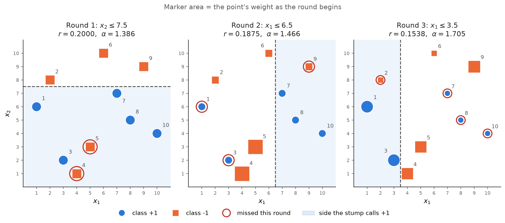
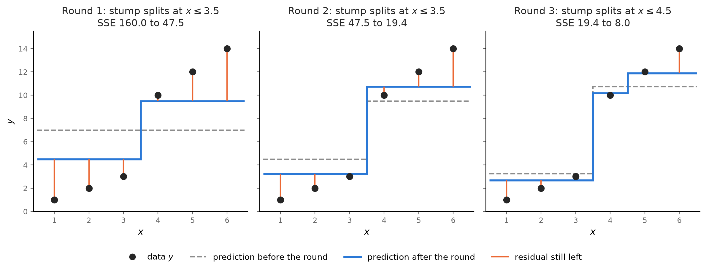

## Learning Objectives

By the end of this lesson you will be able to:

- **Explain** boosting as a sequential ensemble that corrects its predecessor, and
  contrast it with bagging (bias vs variance). *(Understand)*
- **Trace** one round of AdaBoost by hand (weighted error, vote weight, reweighting),
  **explain** why reweighting forces the next stump to differ, and **use** AdaBoost to
  turn stumps into a strong classifier. *(Apply / Understand)*
- **Trace** one round of gradient boosting by hand (residuals, a stump fit to them, a
  shrunken step), and **use** `learning_rate` and `n_estimators` as the regularization
  dials. *(Apply)*
- **Diagnose** boosting overfitting and **apply** early stopping; compare a random
  forest to gradient boosting on the same data. *(Analyze / Apply — in the lab)*

> **Where this sits:** after `L12 — Decision Trees & Bagging`, this lesson **closes Unit
> IV** by meeting bagging's mirror image: where bagging averages independent trees to cut
> *variance*, boosting chains corrective trees to cut *bias*. · next: `L14 — From
> Perceptrons to Neural Networks` (Unit V opens). Note: **Exam I** covers Units I-IV.
>
> **Hands-on:** [Lab — Chaining Weak Stumps](l13_lab_boosting.md) ·
> [](https://colab.research.google.com/github///blob//u04_ensembles/l13_lab_boosting.ipynb)

## Why This Matters

A single decision *stump* — one yes/no question — is almost useless: in the lab it
scores 0.644, a hair above a coin flip. Boosting makes an audacious claim: chain
hundreds of these near-useless stumps, each one focused on the mistakes of the last, and
you get a classifier that rivals the random forest. The trick is not better individual
trees; it is **sequence**. Where bagging (L12) convenes a panel of independent experts
and averages them, boosting runs a **relay** — each runner picks up exactly where the
previous one stumbled — and that attacks the *other* half of the bias-variance budget.

Boosting in its gradient form is, in 2026, the algorithm that wins most tabular-data
competitions and quietly powers countless production models. It is worth understanding
well.

::: {.callout-tip title="Analogy"}
Bagging is a **panel of doctors** who each examine the patient independently; you average
their opinions and the random errors wash out. Boosting is an **apprenticeship**: the
first doctor makes a rough diagnosis, the second studies only the cases the first got
wrong, the third studies what the first two still miss, and so on. Each is mediocre
alone, but the chain — weighted by how reliable each turned out to be — becomes an expert.
:::

## Boosting vs Bagging

The two ensemble families of Unit IV are mirror images, and the contrast is the whole
lesson in one table:

| | **Bagging** (L12) | **Boosting** (L13) |
|--|-------------------|--------------------|
| How trees are built | **in parallel**, independently | **in sequence**, each fixes the last |
| Each tree trains on | a bootstrap resample | the *errors* of the running ensemble |
| Primarily reduces | **variance** | **bias** |
| Base learner | usually deep (low-bias) trees | usually shallow **weak learners** (stumps) |
| Parallelizable? | yes (trees are independent) | no (each needs its predecessor) |
| Risk | hard to overfit | **overfits** if over-run |

Bagging takes high-variance trees and averages the variance away. Boosting takes
high-*bias* weak learners and, by relentlessly focusing on what they get wrong, drives
the bias down. Two different problems, two opposite cures.

## AdaBoost: Reweight the Mistakes

**AdaBoost** (adaptive boosting) builds the relay by reweighting the *data*. Every
training instance carries a weight, and all weights start equal. Each round trains a
stump on the weighted data, gives it a vote, and then **raises the weight of every
instance it misclassified**, so the next stump pays more attention to the hard cases.
The final prediction is a **weighted vote** of all the stumps. For two classes labeled
$+1$ and $-1$, the whole algorithm fits in a few lines:

::: {.algorithm}
$$\begin{array}{l}
\hline
\textbf{Algorithm 1: } \text{AdaBoost} \\
\hline
w_i \leftarrow 1/n \text{ for every point } i \\
\textbf{for } m = 1, \dots, M \textbf{ do} \\
\quad 1.\ \text{fit a stump } h_m \text{ with weights } w \\
\quad 2.\ r_m \leftarrow \textstyle\sum_{i \text{ missed}} w_i \\
\quad 3.\ \alpha_m \leftarrow \ln\frac{1 - r_m}{r_m} \\
\quad 4.\ w_i \leftarrow w_i \, e^{\alpha_m} \text{ if } i \text{ missed} \\
\quad 5.\ w_i \leftarrow w_i \,/\, \textstyle\sum_j w_j \\
\textbf{return } \operatorname{sign}\big(\textstyle\sum_m \alpha_m h_m(x)\big) \\
\hline
\end{array}$$
:::

The error $r$ is a **weighted error rate**: a heavy point counts more when it is missed.
The vote $\alpha$ is $0$ for a stump at chance ($r = 0.5$) and grows as $r$ shrinks, so
an accurate stump gets a loud vote.[^half]

[^half]: Some textbooks write $\alpha = \tfrac{1}{2}\ln\frac{1-r}{r}$. Halving every vote
changes no prediction, because the sign of the vote is all that counts; for the weights,
those books multiply the missed points up and the correct ones down, which gives the same
weights after renormalizing. scikit-learn and Géron use the form above.

### An AdaBoost Toy, Round by Round

Ten points with two features. No single stump can separate the classes:

| Point | $x_1$ | $x_2$ | Label |
|-------|-------|-------|-------|
| 1 | 1 | 6 | $+1$ |
| 2 | 2 | 8 | $-1$ |
| 3 | 3 | 2 | $+1$ |
| 4 | 4 | 1 | $-1$ |
| 5 | 5 | 3 | $-1$ |
| 6 | 6 | 10 | $-1$ |
| 7 | 7 | 7 | $+1$ |
| 8 | 8 | 5 | $+1$ |
| 9 | 9 | 9 | $-1$ |
| 10 | 10 | 4 | $+1$ |

**Round 1.** Every point starts at weight $0.1$. The best stump — the one with the
smallest weighted error $r$ — asks "$x_2 \le 7.5$?" and answers $+1$ below the line,
$-1$ above it. It misses points 4 and 5 (labeled $-1$, but below the line):

$$\begin{aligned}
r_1 &= w_4 + w_5 \\
    &= 0.1 + 0.1 = 0.2 \\
\alpha_1 &= \ln\tfrac{1 - 0.2}{0.2} \\
         &= \ln 4 = 1.386
\end{aligned}$$

Now the reweighting. Points 4 and 5 are multiplied by $e^{1.386} = 4$, so they become
$0.4$; the other eight stay at $0.1$. The new total is $8 \cdot 0.1 + 2 \cdot 0.4 = 1.6$,
and dividing by it gives:

- points 4 and 5: $0.4 / 1.6 = 0.25$ each
- the other eight: $0.1 / 1.6 = 0.0625$ each

::: {.callout-important title="The missed points now hold exactly half the weight"}
After round 1, points 4 and 5 hold $2 \cdot 0.25 = 0.5$ of the total weight. On the new
weights the round-1 stump scores an error of exactly $0.5$ — a coin flip — so it is
useless as round 2's pick, and round 2 is pushed toward a question that gets points 4
and 5 right.

This happens every round, not only here. The missed points held $r$ before the update
and are multiplied by $e^{\alpha} = \frac{1-r}{r}$, so they end up with
$r \cdot \frac{1-r}{r} = 1 - r$, exactly what the correct points hold. Reweighting is a
built-in way of forcing each new stump to look at the data differently.
:::

Rounds 2 and 3 repeat the same steps. Round 2's best stump is "$x_1 \le 6.5$?"
($-1$ on the left, $+1$ on the right), which gets the now-heavy points 4 and 5 right;
round 3's is "$x_1 \le 3.5$?" The figure shows the weights growing and shrinking:

{#fig-adaboost-rounds fig-alt="Three scatter plots of the same ten points, blue circles for class +1 and orange squares for class -1. Round 1: all markers the same size; the stump x2 <= 7.5 misses points 4 and 5, r = 0.2000, alpha = 1.386. Round 2: points 4 and 5 are now the largest markers; the stump x1 <= 6.5 misses points 1, 3 and 9, r = 0.1875, alpha = 1.466. Round 3: points 1, 3 and 9 have grown; the stump x1 <= 3.5 misses points 2, 7, 8 and 10, r = 0.1538, alpha = 1.705."}

Read the markers from left to right: whatever a stump misses is large in the next panel,
and each new stump cuts the plane in a new place to get those large points right. Each
stump still misses two to four points.

**The vote.** The three votes are $\alpha = 1.386$, $1.466$, and $1.705$. For point 1
($x_1 = 1$, $x_2 = 6$), stump 1 says $+1$, stump 2 says $-1$, and stump 3 says $+1$:

$$\begin{aligned}
\text{score} &= 1.386 - 1.466 + 1.705 \\
             &= +1.625 \;\Rightarrow\; +1
\end{aligned}$$

That is correct. The same sum gets **all ten points right**, even though every stump in
it misses at least two. In the lab, AdaBoost over the coqui data climbs from a single
stump's 0.644 to about 0.783 as the stumps accumulate.

::: {.callout-note title="Worked in full: rounds 2 and 3 of AdaBoost (Optional)" collapse="true"}

**Round 2.** The weights are $0.25$ for points 4 and 5 and $0.0625$ for the rest. The
stump "$x_1 \le 6.5$?" ($-1$ on the left) misses points 1, 3, and 9, which are all light:

$$\begin{aligned}
r_2 &= 3 \cdot 0.0625 = 0.1875 \\
\alpha_2 &= \ln\tfrac{0.8125}{0.1875} \\
         &= \ln\tfrac{13}{3} = 1.466
\end{aligned}$$

Points 1, 3, and 9 are multiplied by $\frac{13}{3}$. After renormalizing they hold
$0.1667$ each ($3 \cdot 0.1667 = 0.5$ — half again).

**Two rounds are not enough.** Stumps 1 and 2 disagree on points 1, 3, 4, 5, and 9, and
wherever they disagree the louder vote wins: $1.466 > 1.386$, so the score there is
$\pm 0.080$ in stump 2's favor. That fixes points 4 and 5 but breaks points 1, 3, and 9:
three errors, one more than stump 1 alone.

**Round 3.** The stump "$x_1 \le 3.5$?" ($+1$ on the left) misses points 2, 7, 8, and 10,
each at weight $\tfrac{1}{26} \approx 0.0385$:

$$\begin{aligned}
r_3 &= 4 \cdot \tfrac{1}{26} = 0.1538 \\
\alpha_3 &= \ln\tfrac{0.8462}{0.1538} \\
         &= \ln 5.5 = 1.705
\end{aligned}$$

The weights, grouped by points that always move together:

| Points | After round 1 | After round 2 | After round 3 |
|--------|---------------|---------------|---------------|
| 1, 3, 9 | 0.0625 | 0.1667 | 0.0985 |
| 2, 7, 8, 10 | 0.0625 | 0.0385 | 0.1250 |
| 4, 5 | 0.2500 | 0.1538 | 0.0909 |
| 6 | 0.0625 | 0.0385 | 0.0227 |

Point 6 is never missed, so its weight only shrinks. The final scores
$1.386\,h_1 + 1.466\,h_2 + 1.705\,h_3$:

| Point | Label | Score | Vote |
|-------|-------|-------|------|
| 1, 3 | $+1$ | $+1.625$ | $+1$ |
| 2 | $-1$ | $-1.148$ | $-1$ |
| 4, 5 | $-1$ | $-1.785$ | $-1$ |
| 6 | $-1$ | $-4.557$ | $-1$ |
| 7, 8, 10 | $+1$ | $+1.148$ | $+1$ |
| 9 | $-1$ | $-1.625$ | $-1$ |

Every vote matches its label: zero training errors from three stumps that each miss
two to four points. Lab Step 1 runs this exact loop and checks it against scikit-learn.
:::

> **A version note:** scikit-learn's multiclass AdaBoost implementation uses **SAMME**.
> The probability-based `SAMME.R` option was deprecated in 1.4 and removed in 1.6; the
> `algorithm` parameter itself was deprecated in 1.6 and removed in 1.8. The lab therefore
> uses the current API without an `algorithm` argument.

## Gradient Boosting: Fit the Residuals

**Gradient boosting** takes a different, more general route to the same sequential idea.
Instead of reweighting instances, each new tree is trained to predict the **residuals** —
the errors (L03) — left by the current ensemble. You then *add* a scaled-down copy of
that tree's predictions to the running total, shrinking the leftover error a little
more each round. The mechanism is clearest on a **regression** problem, where a residual
is literally $y - \hat{y}$:

::: {.algorithm}
$$\begin{array}{l}
\hline
\textbf{Algorithm 2: } \text{Gradient boosting} \\
\hline
F_0(x) \leftarrow \bar{y} \text{ (the mean of } y\text{)} \\
\textbf{for } m = 1, \dots, M \textbf{ do} \\
\quad 1.\ \text{res}_i \leftarrow y_i - F_{m-1}(x_i) \\
\quad 2.\ \text{fit a small tree } h_m \text{ to the res}_i \\
\quad 3.\ F_m(x) \leftarrow F_{m-1}(x) + \nu \, h_m(x) \\
\textbf{return } F_M(x) \\
\hline
\end{array}$$
:::

The factor $\nu$ (nu) is the **learning rate**. The ensemble is an **additive**
(stagewise) model, $F(x) = F_0 + \sum_m \nu\, h_m(x)$, each $h_m$ a small tree fit to
what was still wrong when it was trained.

### A Gradient-Boosting Toy, Round by Round

Six points, $x = 1, \dots, 6$, with $y = 1, 2, 3, 10, 12, 14$: a big jump between two
groups, and a rising trend inside the top group. The trees are stumps and $\nu = 0.5$.

**Round 0.** Before any tree, predict the mean: $F_0 = 42 / 6 = 7$ for every point. The
residuals are $-6, -5, -4, 3, 5, 7$, and the sum of squared errors (SSE) is $160$.

**Round 1.** The stump is fit to the *residuals*, not to $y$. Its best split — the one
that leaves the smallest squared error on its two sides — is $x \le 3.5$, and each leaf predicts the mean residual on its side:
$(-6 - 5 - 4)/3 = -5$ on the left, $(3 + 5 + 7)/3 = +5$ on the right. Only half of that
step is taken:

$$\begin{aligned}
\text{left: } F_1 &= 7 + 0.5 \cdot (-5) = 4.5 \\
\text{right: } F_1 &= 7 + 0.5 \cdot 5 = 9.5
\end{aligned}$$

The SSE drops from $160$ to $47.5$. The new residuals are
$-3.5, -2.5, -1.5, 0.5, 2.5, 4.5$.

**Round 2 picks the same split again.** Those residuals still split most cleanly at
$x \le 3.5$, with leaves $\pm 2.5$, because round 1 only went halfway. The predictions
move to $3.25$ and $10.75$ (SSE $19.4$). This is the learning rate made visible: with
$\nu = 0.5$ each tree closes half of the gap it sees, so the next tree finishes the job
before the ensemble moves on. Only in round 3, with the big jump mostly learned, does a
new split appear: $x \le 4.5$, which starts on the rising trend inside the top group.

{#fig-gb-rounds fig-alt="Three panels of the same six points (x = 1 to 6; y = 1, 2, 3, 10, 12, 14). Round 1: the stump splits at x <= 3.5; the prediction moves from a flat 7 to 4.5 and 9.5; SSE 160.0 to 47.5. Round 2: the stump splits at x <= 3.5 again; the prediction moves to 3.25 and 10.75; SSE 47.5 to 19.4. Round 3: the stump splits at x <= 4.5; the prediction becomes 2.69, 10.19 and 11.88; SSE 19.4 to 8.0."}

Watch the orange residuals: each round, the step moves toward the points and the
segments shorten. No tree is ever fit to $y$ itself: each one sees only what the
ensemble so far still gets wrong.

::: {.callout-note title="Worked in full: three rounds of gradient boosting (Optional)" collapse="true"}

Each round fits a stump to the residuals, then takes a step of $\nu = 0.5$ times the
stump's prediction:

| Round | Stump on the residuals | Predictions after | SSE |
|-------|------------------------|-------------------|-----|
| 0 | none (the mean) | $7$ for all six | $160$ |
| 1 | $x \le 3.5$: $-5$ / $+5$ | $4.5$, $9.5$ | $47.5$ |
| 2 | $x \le 3.5$: $-2.5$ / $+2.5$ | $3.25$, $10.75$ | $19.375$ |
| 3 | $x \le 4.5$: $-1.125$ / $+2.25$ | $2.69$, $10.19$, $11.88$ | $7.984$ |

Round 3 in detail. The residuals after round 2 are
$-2.25, -1.25, -0.25, -0.75, 1.25, 3.25$. The split $x \le 4.5$ puts the first four on
the left (mean $-1.125$) and the last two on the right (mean $+2.25$). So points 1-3 go
to $3.25 - 0.5625 = 2.6875$, point 4 to $10.75 - 0.5625 = 10.1875$, and points 5-6 to
$10.75 + 1.125 = 11.875$. Point 4 is now predicted apart from 5 and 6 for the first time.
Each leaf value is a mean, as in any regression tree: the mean is the constant that
minimizes the squared error on that side.

Lab Step 1 runs this exact loop and checks it against scikit-learn's
`GradientBoostingRegressor`; Exercise 3 adds a fourth round.
:::

**Classification works the same way, on a different scale.** The lab's
`GradientBoostingClassifier` runs the same loop on the *log-odds* scale of logistic
regression (L04). Each tree is fit to $y - \hat{p}$: the 0/1 label minus the predicted
probability. That quantity is called a **pseudo-residual**. The name "gradient" comes
from here: for any loss, the tree is fit to the negative gradient of the loss with
respect to the current prediction — the downhill direction of gradient descent (L03). For
squared error that direction is the ordinary residual $y - F$ (up to a factor of 2);
for log loss it is $y - \hat{p}$.

The learning rate $\nu$ is exactly the **shrinkage regularization** of L10 in a new
costume: it scales down each tree's contribution so the ensemble inches toward the
answer rather than leaping — the toy's repeated split is that inching. A *small*
learning rate generalizes better but needs *more* trees; a *large* one fits fast and
**overfits** — in the lab a rate of 0.01 lands at test 0.822 while a rate of 1.0 drives
*training* accuracy to a perfect, over-fit 1.000. Learning rate and number of trees are
tuned together.

### Weights or Targets: What the Next Learner Sees

Both algorithms hand the next learner "what is still wrong", but they encode it
differently:

| | Next learner's data | What changes each round |
|--|---------------------|-------------------------|
| **AdaBoost** | the same labels | the **weights** on the points |
| **Gradient boosting** | the same points, equal weight | the **targets** (residuals) |

```{mermaid}
flowchart TD
  D["Training set"] --> M1["Weak learner 1<br/>(a shallow tree)"]
  M1 --> E1["What it still gets wrong<br/>(reweight, or take residuals)"]
  E1 --> M2["Weak learner 2<br/>trained on those errors"]
  M2 --> E2["What the pair still gets wrong"]
  E2 --> Md["...Weak learner M"]
  Md --> S["Weighted sum of all learners"]
  S --> P["Prediction"]
```

The diagram is the relay both algorithms share: one chain, where each learner has to
wait for the one before it. Compare L12's bagging diagram, where every tree is built side
by side from its own bootstrap sample. That single difference is why boosting cannot
be parallelized across trees and bagging can.

## Tuning and Early Stopping

Because more rounds keep reducing *training* error, boosting will happily overfit if you
let it run too long. Two guards:

- **Early stopping** — hold out a small validation slice and stop adding trees when it
  stops improving (`n_iter_no_change`). In the lab this halts at 92 trees and matches the
  best hand-tuned test score (0.822) with no manual search.
- **Shrinkage + shallow trees** — a small `learning_rate` and a shallow `max_depth` (2-3)
  keep each step modest, trading more rounds for better generalization.

In practice you rarely write the loop yourself: **XGBoost** and **LightGBM** are the
industrial gradient-boosting libraries — faster, regularized, and competition-dominating —
but they are the same idea as scikit-learn's `GradientBoostingClassifier`, which the lab
uses.

## Common Pitfalls

- **Over-boosting.** More trees is not always better — past the sweet spot, test error
  climbs even as training error keeps falling. Use early stopping or CV to pick the count.
- **AdaBoost on noisy labels.** Because it keeps upweighting whatever it gets wrong,
  AdaBoost will obsess over mislabeled or outlier points and chase the noise. Gradient
  boosting with a small learning rate is gentler.
- **Cranking the learning rate to train faster.** A large rate reaches high training
  accuracy quickly and overfits; the reliable recipe is a *small* rate with *more* trees.
- **Expecting parallel speed.** Boosting is sequential by construction — each tree needs
  the one before it — so it does not parallelize across trees the way a random forest does.

::: {.callout-note title="Deep Dive: where AdaBoost's formulas come from (Optional)" collapse="true"}

The vote $\alpha = \ln\frac{1-r}{r}$ has three regimes. A stump at chance ($r = 0.5$)
gets $\alpha = 0$ and is ignored; a better-than-chance stump gets $\alpha > 0$, growing
without bound as $r \to 0$; a *worse*-than-chance stump gets $\alpha < 0$, so its vote
is flipped and it becomes useful anyway. scikit-learn's `learning_rate` multiplies every
$\alpha$ (the toy used 1.0; the lab uses 0.5), shrinking each stump's influence the same
way $\nu$ does in gradient boosting.

The formulas are not arbitrary. It can be shown that AdaBoost's reweight-and-vote loop
is a stagewise minimization of the **exponential loss** $e^{-y F(x)}$, where $F$ is the
weighted vote: each round adds the one stump, with the one vote, that lowers that loss
the most. That loss-minimizing vote is the footnote's $\tfrac{1}{2}\ln\frac{1-r}{r}$;
this page's votes are exactly twice as large, which changes no prediction and no
weight after renormalizing. That is the bridge to gradient boosting, which runs the same stagewise
minimization for *any* differentiable loss by fitting each tree to the loss's negative
gradient.
:::

## FAQ / Industry Reality

**"AdaBoost or gradient boosting?"** — Gradient boosting is the modern default: more
flexible (any differentiable loss), better behaved on noisy data, and the basis of
XGBoost/LightGBM. AdaBoost is the historically important, easy-to-explain ancestor and
still fine on clean data, but new projects usually reach for gradient boosting.

**"Boosting or a random forest?"** — Try the random forest first: it is strong out of the
box, hard to overfit, and needs almost no tuning. Tuned gradient boosting often wins the
last few points — in the lab they finish neck-and-neck (forest 0.817, gradient boosting
0.811) — but boosting demands care with the learning rate, tree depth, and number of
rounds. The forest is the safe baseline; boosting is the performance ceiling.

**"What is XGBoost?"** — A highly optimized, regularized gradient-boosting library (with
LightGBM and CatBoost as cousins). Same core idea as this lesson — additive trees fit to
residuals — with engineering for speed, built-in regularization, and missing-value
handling. It is the workhorse behind a large share of winning tabular-data models.

## Summary / Cheat-sheet

| Concept | The one-liner |
|---------|---------------|
| Boosting | a sequential ensemble; each learner corrects its predecessor (cuts bias) |
| vs Bagging | bagging is parallel and cuts variance; boosting is sequential and cuts bias |
| Weak learner | a model barely better than chance (a stump); boosting's raw material |
| AdaBoost | reweight the misclassified each round; combine by a weighted vote |
| Weighted error $r$ | the total weight of the points a stump misses |
| Vote $\alpha$ | $\ln\frac{1-r}{r}$: zero at chance, louder as $r$ shrinks |
| Reweighting | missed weights times $e^{\alpha}$, renormalize; the missed then hold half |
| SAMME | scikit-learn's current discrete AdaBoost algorithm; the old algorithm selector is gone |
| Gradient boosting | fit each new tree to the residual errors; add them (additive model) |
| One GB round | residuals $y - F$, stump on them, $F \mathrel{+}= \nu \cdot$ stump |
| Weights vs targets | AdaBoost changes the weights; gradient boosting changes the targets |
| learning_rate | shrinkage regularization; small rate + more trees generalizes best |
| Early stopping | `n_iter_no_change` halts when validation stops improving |
| XGBoost / LightGBM | the industrial gradient-boosting libraries (named) |

## Where to Go Deeper

- **Course text:** Géron, *Hands-On Machine Learning*, ch. 7 — the boosting half (AdaBoost,
  gradient boosting, early stopping) that this lesson follows.
- **Docs:** [scikit-learn's ensemble guide](https://scikit-learn.org/stable/modules/ensemble.html#adaboost)
  — AdaBoost and gradient boosting with runnable examples and the tuning parameters.
- **Text, deeper:** James et al., *An Introduction to Statistical Learning*, ch. 8 — boosting
  alongside bagging and random forests, with the bias-variance reasoning behind each.
